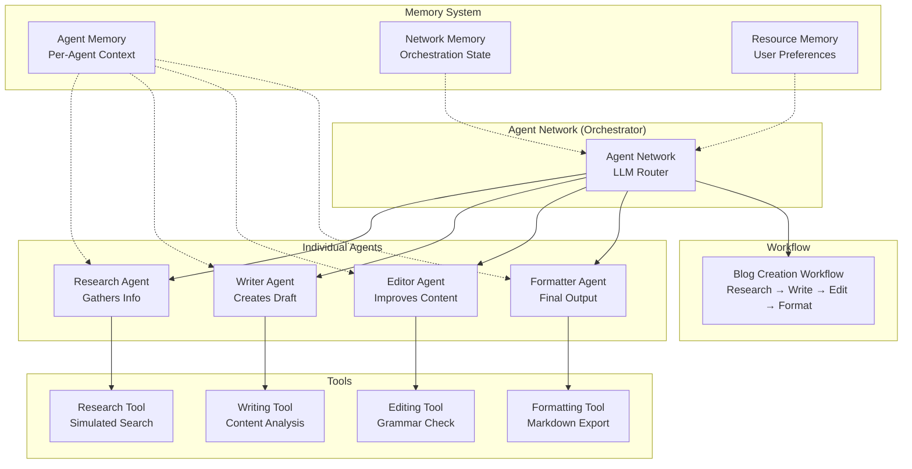

# 📚 Blog Post Network: Learning Mastra Agent Networks

**A hands-on educational project to master Mastra's agent network architecture by building a simple content creation system**

---

## 🎯 Learning Mission

This project is designed to teach you **EVERY** primitive and pattern in Mastra's agent network ecosystem through practical implementation. By building a simple blog post creation network, you'll understand the same architecture that powers complex systems like the AI Storyboard Generator, but in a much simpler, more digestible form.

### What You'll Master

- ✅ **Agent Networks (vNext)**: Dynamic routing with `.generate()` and `.loop()` methods
- ✅ **Agent Architecture**: Building specialized agents with tools, memory, and evals
- ✅ **Tool Creation**: Implementing Zod-validated tools with async execution
- ✅ **Memory Systems**: Thread vs resource scope, semantic recall, working memory
- ✅ **Workflows**: Sequential and parallel step composition
- ✅ **Evaluation Metrics**: Heuristic, LLM-based, and custom scorers
- ✅ **Type Safety**: Zod schemas and TypeScript patterns
- ✅ **Runtime Context**: Dependency injection and state management
- ✅ **Streaming**: Real-time progress for better UX

---

## 🏗️ Architecture Overview



---

## 📊 Learning Comparison: Simple vs Complex

| Component | Our Blog Network | Storyboard Template | What You'll Learn |
|-----------|-----------------|-------------------|-------------------|
| **Agents** | 4 text-focused agents | 5 multimedia agents | Agent creation, instructions, model config |
| **Tools** | 4 simple tools | 6 complex tools (APIs, files) | Tool patterns, validation, execution |
| **Network** | 1 vNext network | 2 networks (vNext + legacy) | Routing, memory, primitive selection |
| **Workflow** | 1 linear workflow | 1 parallel workflow | Step composition, data flow |
| **Memory** | 3 configs (basic) | 3 configs (advanced) | Scoping, semantic recall, persistence |
| **Evals** | 5 metrics | 11 metrics | Heuristic vs LLM-based evaluation |
| **Output** | Markdown text | PDFs with images | Export patterns, formatting |
| **External** | None | AWS S3, Google Drive, Zapier | Integration patterns (future learning) |

---

## 📁 Project Structure

```
blog-post-network/
├── 📄 README.md                    # You are here!
├── 📄 package.json                 # Dependencies & scripts
├── 📄 tsconfig.json               # TypeScript config
├── 📄 .env.example                # API keys template
├── 📄 .gitignore                  # Git ignore rules
│
├── 📁 src/mastra/                 # All Mastra code
│   ├── 📄 index.ts                # Main Mastra configuration & exports
│   ├── 📄 memory-config.ts        # Memory system configuration
│   │
│   ├── 📁 agents/                 # Individual agents (4 total)
│   │   ├── 📄 research-agent.ts   # Gathers information on topics
│   │   ├── 📄 writer-agent.ts     # Creates article drafts
│   │   ├── 📄 editor-agent.ts     # Reviews and improves content
│   │   └── 📄 formatter-agent.ts  # Converts to final markdown
│   │
│   ├── 📁 tools/                  # Agent tools (4 total)
│   │   ├── 📄 research-tool.ts    # Simulated web search
│   │   ├── 📄 writing-tool.ts     # Content quality analysis
│   │   ├── 📄 editing-tool.ts     # Grammar and style checking
│   │   └── 📄 formatting-tool.ts  # Markdown generation
│   │
│   ├── 📁 schemas/                # Type-safe validation
│   │   ├── 📄 blog-post-schema.ts # Blog post structure
│   │   ├── 📄 research-schema.ts  # Research data structure
│   │   └── 📄 content-schema.ts   # Content validation
│   │
│   ├── 📁 workflows/              # Automated pipelines
│   │   └── 📄 blog-creation-workflow.ts  # Complete blog pipeline
│   │
│   ├── 📁 agentnetwork/           # Network orchestration
│   │   └── 📄 blog-network.ts     # vNext Agent Network
│   │
│   ├── 📁 evals/                  # Quality metrics
│   │   ├── 📄 index.ts            # Eval exports
│   │   ├── 📄 research-evals.ts   # Research quality metrics
│   │   ├── 📄 content-evals.ts    # Content quality metrics
│   │   └── 📄 format-evals.ts     # Format validation metrics
│   │
│   └── 📁 scorers/                # Custom evaluation
│       └── 📄 writing-quality-scorer.ts  # LLM-based writing judge
│
├── 📁 examples/                   # Usage examples
│   ├── 📄 01-basic-agent.ts       # Single agent usage
│   ├── 📄 02-agent-with-tool.ts   # Agent + tool integration
│   ├── 📄 03-workflow.ts          # Workflow execution
│   ├── 📄 04-network-generate.ts  # Network .generate() method
│   ├── 📄 05-network-loop.ts      # Network .loop() method
│   ├── 📄 06-streaming.ts         # Streaming responses
│   ├── 📄 07-memory.ts            # Memory persistence
│   └── 📄 08-evaluation.ts        # Running evals
│
└── 📁 generated-output/           # Generated blog posts
    └── .gitkeep
```

---

## 🚀 Implementation Roadmap

### Phase 1: Foundation (Core Understanding)
- [ ] **Step 1.1**: Create basic schemas with Zod
- [ ] **Step 1.2**: Set up memory configuration
- [ ] **Step 1.3**: Configure main Mastra instance
- **Checkpoint**: You understand type safety and configuration

### Phase 2: Tools (Building Blocks)
- [ ] **Step 2.1**: Implement research-tool (simple fake data)
- [ ] **Step 2.2**: Implement writing-tool (basic analysis)
- [ ] **Step 2.3**: Implement editing-tool (grammar check)
- [ ] **Step 2.4**: Implement formatting-tool (markdown)
- **Checkpoint**: You understand tool patterns and execution

### Phase 3: Agents (Intelligence Layer)
- [ ] **Step 3.1**: Create research-agent with tool
- [ ] **Step 3.2**: Create writer-agent with memory
- [ ] **Step 3.3**: Create editor-agent with instructions
- [ ] **Step 3.4**: Create formatter-agent with output schema
- **Checkpoint**: You understand agent architecture

### Phase 4: Workflow (Automation)
- [ ] **Step 4.1**: Create workflow steps
- [ ] **Step 4.2**: Chain steps sequentially
- [ ] **Step 4.3**: Add error handling
- [ ] **Step 4.4**: Test workflow execution
- **Checkpoint**: You understand workflow composition

### Phase 5: Agent Network (Orchestration)
- [ ] **Step 5.1**: Create vNext network with routing
- [ ] **Step 5.2**: Implement .generate() method
- [ ] **Step 5.3**: Implement .loop() method
- [ ] **Step 5.4**: Test dynamic routing
- **Checkpoint**: You understand LLM-based orchestration

### Phase 6: Evaluation (Quality)
- [ ] **Step 6.1**: Create heuristic metrics
- [ ] **Step 6.2**: Create LLM-based metrics
- [ ] **Step 6.3**: Create custom scorer
- [ ] **Step 6.4**: Integrate with agents
- **Checkpoint**: You understand quality measurement

### Phase 7: Advanced Features
- [ ] **Step 7.1**: Add streaming support
- [ ] **Step 7.2**: Implement semantic recall
- [ ] **Step 7.3**: Add working memory
- [ ] **Step 7.4**: Create helper functions
- **Checkpoint**: You've mastered the architecture!

---

## 🛠️ Installation & Setup

### Prerequisites
- Node.js 18 or higher
- npm or yarn
- API keys for OpenAI and Google Gemini

### Quick Start
```bash
# Clone or navigate to project
cd blog-post-network

# Install dependencies
npm install

# Copy environment template
cp env.example .env

# Add your API keys to .env
OPENAI_API_KEY=your_openai_key_here
GOOGLE_API_KEY=your_google_key_here

# Start development
npm run dev
```

---

## 💻 Usage Examples

### 1. Using Individual Agents
```typescript
import { researchAgent } from './src/mastra/agents/research-agent';

// Direct agent usage
const result = await researchAgent.generate(
  "Research benefits of TypeScript",
  { 
    output: z.object({
      points: z.array(z.string()),
      summary: z.string()
    })
  }
);
```

### 2. Using the Workflow
```typescript
import { blogCreationWorkflow } from './src/mastra/workflows/blog-creation-workflow';

// Run complete pipeline
const run = await blogCreationWorkflow.createRunAsync();
const result = await run.start({
  inputData: {
    topic: "Benefits of TypeScript",
    style: "technical",
    length: "medium"
  }
});
```

### 3. Using Agent Network (Simple Task)
```typescript
import { blogNetwork } from './src/mastra/agentnetwork/blog-network';

// Single primitive execution
const result = await blogNetwork.generate(
  "Write a blog post about TypeScript",
  { runtimeContext }
);
```

### 4. Using Agent Network (Complex Task)
```typescript
// Multi-step task with memory
const result = await blogNetwork.loop(
  "Research TypeScript, JavaScript, and Python. Compare them. Write a comprehensive blog post with examples.",
  { runtimeContext }
);
```

---

## 🧪 Testing Each Component

### Test Tools Individually
```bash
npx tsx examples/01-basic-agent.ts
```

### Test Workflow
```bash
npx tsx examples/03-workflow.ts
```

### Test Network Routing
```bash
npx tsx examples/04-network-generate.ts
```

### Test Memory Persistence
```bash
npx tsx examples/07-memory.ts
```

### Run All Tests
```bash
for i in {1..8}; do npx tsx examples/0$i-*.ts; done
```

---

## 📚 Learning Resources

### Key Concepts to Understand

#### 1. **Agent Networks vs Workflows**
- **Workflows**: Deterministic, you define the exact path
- **Agent Networks**: Non-deterministic, LLM decides the path
- **When to use each**: Workflows for known processes, Networks for dynamic tasks

#### 2. **Memory Scopes**
- **Thread Scope**: Memory for a single conversation
- **Resource Scope**: Memory across all conversations for a user
- **Working Memory**: Persistent context template

#### 3. **Tool Patterns**
```typescript
export const myTool = createTool({
  id: 'unique-id',
  description: 'Used by LLM to understand when to call',
  inputSchema: z.object({ /* validation */ }),
  outputSchema: z.object({ /* validation */ }),
  execute: async ({ context, runtimeContext }) => {
    // Implementation
    return { /* output matching schema */ };
  }
});
```

#### 4. **Agent Instructions**
- Be specific about agent capabilities
- Include examples in instructions
- Define clear boundaries of responsibility

#### 5. **Evaluation Metrics**
- **Heuristic**: Rule-based (fast, deterministic)
- **LLM-based**: AI judge (flexible, expensive)
- **Score Range**: Always 0.0 to 1.0

---

## 🔍 Debugging Tips

### Common Issues & Solutions

| Issue | Solution |
|-------|----------|
| Agent not using tool | Check tool description is clear |
| Network choosing wrong primitive | Improve agent/workflow descriptions |
| Memory not persisting | Verify resource scope is set |
| Workflow failing | Check step schemas match |
| Evaluation scores low | Review metric implementation |

### Logging Pattern
```typescript
console.log('🚀 [Component] Starting operation...');
console.log('📊 [Component] Data:', { key: value });
console.log('✅ [Component] Success!');
console.log('❌ [Component] Error:', error);
```

---

## 🎓 Learning Checkpoints

After completing each phase, you should be able to answer:

### Phase 1 ✓
- What is Zod and why use it?
- How does memory configuration work?
- What goes in the Mastra constructor?

### Phase 2 ✓
- What are the required fields for a tool?
- How does the execute function work?
- Why do we need input/output schemas?

### Phase 3 ✓
- What's the difference between instructions and description?
- How do agents use tools?
- When should an agent have memory?

### Phase 4 ✓
- How do you chain workflow steps?
- What's the difference between .then() and .parallel()?
- How does data flow between steps?

### Phase 5 ✓
- When does the network route to agents vs workflows?
- What's the difference between .generate() and .loop()?
- Why is memory required for .loop()?

### Phase 6 ✓
- What's the difference between heuristic and LLM metrics?
- How do you create a custom scorer?
- What should scores range be?

### Phase 7 ✓
- How does streaming improve UX?
- What is semantic recall?
- How does working memory persist?

---

## 🚀 Next Steps

Once you've mastered this architecture, you can:

1. **Add External APIs**: Real web search, databases
2. **Implement Real Tools**: Actual grammar checking, SEO analysis
3. **Create Complex Networks**: Multi-stage content pipelines
4. **Build Production Features**: Rate limiting, caching, error recovery
5. **Integrate Services**: CMS publishing, social media posting

---

## 🤝 Contributing to Your Learning

### Self-Assessment Questions
After building each component, ask yourself:
- Can I explain this to someone else?
- Could I build this again from scratch?
- Do I understand why it's designed this way?
- Can I modify it for a different use case?

### Experimentation Ideas
- Try different agent instructions
- Modify tool implementations
- Change workflow order
- Test edge cases
- Break things on purpose!

---

## 📖 References

### Based On
- [Mastra vNext Networks Documentation](https://mastra.ai/docs/networks-vnext)
- [AI Storyboard Generator Template](../template-ai-storyboard-consistent-character)

### Key Patterns From
- Agent architecture from storyboard-agent.ts
- Tool patterns from image-generation-tool.ts
- Network patterns from agent-network.ts
- Memory patterns from memory-config.ts
- Workflow patterns from agent-network-automated-workflow.ts

---

## 📝 License

MIT - This is a learning project, use it however helps you learn best!

---

## 🎯 Final Goal

By the end of this project, you should be able to:
- **Build any agent network** from scratch
- **Understand every Mastra primitive** deeply
- **Debug complex multi-agent systems** confidently
- **Design your own agent architectures** thoughtfully

**Remember**: The goal isn't just to make this work—it's to understand WHY and HOW it works so you can build your own amazing systems!

---

*Happy Learning! 🚀 Start with Step 1.1 and build your understanding piece by piece.*
